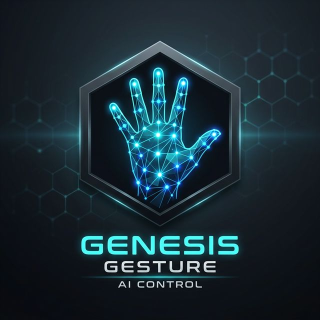

# 🖐️ AI Virtual Control Suite



A high-performance, AI-driven gesture control system that turns your webcam into a bridge between your hands and your computer. Say goodbye to physical peripherals and hello to the future of touchless interaction.

## Acknowledgments
- **MediaPipe Team** for their incredible Hand Landmark model.
- **OpenCV Community** for providing the tools to see the world.
- **PyAutoGUI Developers** for making OS-level automation a breeze.
- Inspired by the vision of a "Minority Report" style computing interface.

## API Reference

This project is built as a modular suite. Here’s how the internal pieces fit together:

| Module | Purpose |
| :--- | :--- |
| [`main.py`](main.py) | The brain that runs the main loop and coordinates between modules. |
| [`hand_tracker`](modules/hand_tracker.py) | Handles the heavy lifting of detecting 21 hand landmarks in real-time. |
| [`mouse_control`](modules/mouse_control.py) | Translates finger pincers into clicks, drags, and scrolling. |
| [`keyboard_control`](modules/keyboard_control.py) | Manages the virtual QWERTY layout and keyboard event simulation. |
| [`drawing_utils`](utils/drawing_utils.py) | A utility for rendering the status bar and feedback HUD. |

## Appendix

### Notes
- Designed to work on standard 720p/1080p webcams.
- Uses **PyAutoGUI Failsafe**: Move your hand to the corner of the screen to stop execution instantly.
- Currently optimized for single-hand interaction to ensure maximum precision.

### References
- [MediaPipe Hands Documentation](https://google.github.io/mediapipe/solutions/hands.html)
- [PyAutoGUI Docs](https://pyautogui.readthedocs.io/)
- [OpenCV Tutorials](https://docs.opencv.org/)

## Author
[**Hibah Rehman**]
-Student/Developer at UVAS
- AI/ML Developer & Computer Vision Enthusiast
- GitHub: [hibahrehman25-lang](https://github.com/hibahrehman25-lang)
- Email: [hibahrehman25@gmail.com](hibahrehman25@gmail.com)

## Badges


## Contributing
I'd love your help! Whether it's adding a new gesture, fixing a bug, or just improving the UI, your contributions are more than welcome.
1. Fork the repo.
2. Create your feature branch.
3. Submit a Pull Request.
4. Let's build the future together!

## Demo
Launch the app and you'll see a high-tech HUD overlay on your camera feed.
- **Top Zone**: Your virtual mouse pad.
- **Bottom Zone**: Your interactive QWERTY keyboard.
- **Status Bar**: Real-time feedback on what the AI is thinking.

## Deployment
Setting this up is a walk in the park:
1. **Clone & Enter**:
   ```bash
   git clone https://github.com/hibahrehman25-lang/Smart_Gesture_interface.git
   cd Smart_Gesture_interface
   ```
2. **Environment Setup**:
   ```bash
   python -m venv .venv
   .venv\Scripts\activate
   ```
3. **Install & Launch**:
   ```bash
   pip install -r requirements.txt
   python main.py (for desktop only interface)
   python run_app.py (for high_end suit iterferance)
   ```

## FAQ
#### Q: My camera is laggy, what should I do?
Ensure you have good lighting! The AI needs to see your joints clearly to calculate gestures at 30fps.
#### Q: Can I use this for gaming?
Absolutely! The virtual mouse can handle clicking and dragging, perfect for strategy games.

## Documentation
The code is fully documented with docstrings and logical splits.
- `HandLandmarker` parameters can be tuned in `main.py` for higher sensitivity.
- `keyboard_control` is modular—you can easily add custom keys or macros.

## Environment Variables
This project uses direct configuration in `main.py`:
- `CAMERA_INDEX`: Default is `0`. Change to `1` or `2` if you have multiple webcams.

## 🛠 Skills
- AI & Computer Vision (Landmark Detection)
- Human-Computer Interaction (HCI) Design
- OS-Level Automation with Python
- Modular Software Architecture

  
## Features 🚀
- **Virtual Mouse**: Move, Click, Right-Click, and Scroll with zero physical touch.
  - **Move**: Index finger (Landmark 8).
  - **Left Click**: Pinch Index & Thumb (Quick tap).
  - **Drag & Drop**: Hold Index & Thumb pinch for > 0.4s.
  - **Right Click**: Pinch Index & Middle fingers (Quick touch).
  - **Scroll**: Pinch/Hold Index & Middle fingers and move vertically.
- **Interactive Keyboard**: Type any character, including complex `CTRL+C` or `SHIFT+A` shortcuts.
  - **Type**: Hover Index Finger over a key and Pinch with Thumb to select.
  - **Modifiers**: Pinch over Shift/Ctrl to toggle (Sticky mode).
- **Latching Modifiers**: Sticky keys (Shift, Ctrl) that stay active until your next press.
- **Stabilized HUD**: A clean, jitter-free interface that tells you exactly what's happening.
- **Always-on-Top**: The CV window stays visible even when you are controlling other apps.


## Feedback 📝
I'm always looking to improve! If you find a bug or have a feature idea:
- Shoot me an email: [hibahrehman25@gmail.com](hibahrehman25@gmail.com)
- Open a [GitHub Issue](https://github.com/hibahrehman25-lang/Smart_Gesture_interface.git)

## About Me 👩💻
Hey there! I'm **Hibah**, a developer who's obsessed with AI and Computer Vision. I built this project to explore how we can interact with machines more naturally. When I'm not tweaking landmark confidence scores, I'm usually learning about the next big thing in AI.

## LinkedIn

Connect with me on LinkedIn:  
[Hibah Rehman](https://www.linkedin.com/in/hibah-rehman-9b883a375)
